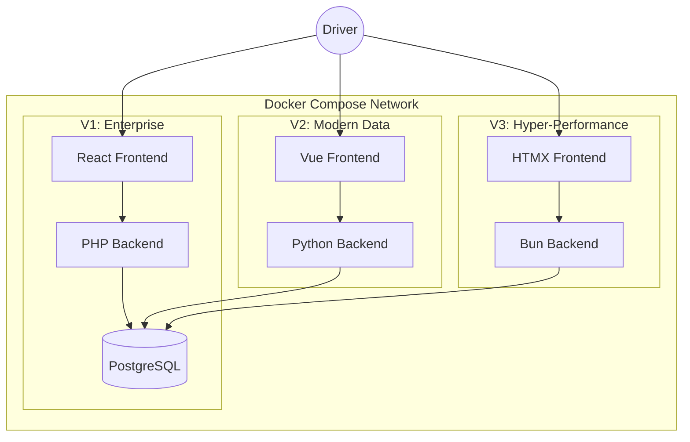
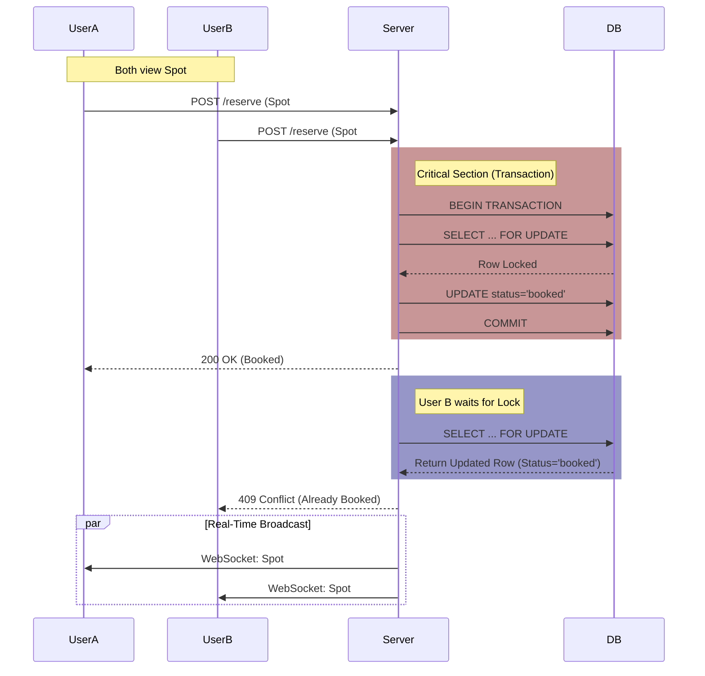

# Spec: Smart Parking System

## 1. Executive Summary
Development of a full-stack parking reservation system with concurrency handling, real-time updates, and background processing. The system must be implemented in 3 distinct variants (PHP, Python, Bun) within a single repository, orchestrated via Docker Compose.

## 2. Infrastructure & Topology

### 2.1. System Architecture


### 2.2. Concurrency & Real-Time Flow


## 3. Domain Models & Schema

### 2.1. Parking Spot
| Field | Type | Description |
| :--- | :--- | :--- |
| `id` | UUID/Int | Unique identifier (pk) |
| `name` | String | e.g. "Spot 1" |
| `type` | Enum | `regular`, `handicap` (optional) |

### 2.2. Reservation
| Field | Type | Description |
| :--- | :--- | :--- |
| `id` | UUID/Int | Unique identifier (pk) |
| `spot_id` | FK | References Parking Spot |
| `user_id` | String | Email/ID of the driver |
| `start_time` | DateTime | Start of booking |
| `end_time` | DateTime | End of booking |
| `status` | Enum | `active`, `completed` |

**Constraint:** No ORM "auto-sync" features. Database migrations must be explicit SQL or migration scripts.

## 3. API Specification (REST)

### 3.1. Authentication
*   **POST** `/login`
    *   **Input:** `{ "email": "...", "password": "..." }`
    *   **Output:** JWT Token.
    *   **Logic:** Validate against pre-seeded users (`driver1` / `driver2`).

### 3.2. Spots
*   **GET** `/spots`
    *   **Output:** List of all parking spots.

### 3.3. Reservations
*   **POST** `/reservations`
    *   **Input:** `{ "spot_id": 1, "start_time": "...", "end_time": "..." }`
    *   **Headers:** `Authorization: Bearer <token>`
    *   **Critical Logic (Concurrency):**
        *   MUST handle race conditions.
        *   If User A and User B book Spot #5 at the same millisecond, only ONE succeeds.
        *   Implementation: Database Locking (`FOR UPDATE`).
    *   **Output:** `201 Created` or `409 Conflict` (user-friendly error).

*   **PUT** `/reservations/{id}/complete`
    *   **Logic:** Mark reservation as `completed` and free the spot immediately.

### 3.4. Analytics (Bonus)
*   **GET** `/stats`
    *   **Output:** JSON object returning peak occupancy hours or general usage stats.
    *   **Example:** `{ "peak_hour": 14, "total_reservations": 42 }`

## 4. Background Processing ("The Stale Checker")
*   **Frequency:** Periodic (e.g., every minute).
*   **Logic:** Find reservations where `status = 'active'` AND `end_time < NOW()`.
*   **Action:** Mark as `completed` and free the spot.
*   **Logging:** Must log actions (e.g., "Auto-released Spot #105").

## 5. Real-Time Updates (WebSockets)
*   **Trigger:**
    1.  Driver reserves a spot (API).
    2.  Driver releases a spot (API).
    3.  Background worker auto-releases a spot.
*   **Effect:** Broadcast update to all connected clients.
*   **Client Response:** Update UI (Green/Red) *instantly* without page reload.

## 6. Infrastructure & Tooling
*   **Migrations:** MUST NOT use ORM auto-sync. MUST use a migration tool (e.g., `knex`, `alembic`, `dbmate`) to run SQL scripts on startup.
*   **Git:** `.gitignore` must exclude `node_modules`, `venv`, `.env`, etc.
*   **Architecture:** Integrate into provided Vanilla JS App.
*   **Variant Constraints:**
    *   **V1:** Embed **React** component.
    *   **V2:** Embed **Vue** component.
    *   **V3:** Embed **HTMX** (Server-Side logic).
*   **Logic:**
    *   Display 5 Spots.
    *   3 Time Slots per day (08-12, 12-16, 16-20).
    *   Visual States: 🟢 Available, 🔴 Booked.

## 7. Topology & Directory Structure
```text
/home/gp/projects/Oktopost/
  ├── implementations/
  │   ├── v1-php-react/    # PHP Backend, React integrated Frontend
  │   ├── v2-python-vue/   # Python Backend, Vue integrated Frontend
  │   └── v3-bun-htmx/     # Bun Backend, HTMX integrated Frontend
  └── docker-compose.yml   # Orchestrates DB + All 3 Backends
```

## 8. Acceptance Criteria
1.  [ ] **Concurrency Test:** Simulating 20 parallel requests for the same spot results in exactly 1 success.
2.  [ ] **Real-Time:** Two browser windows sync state accurately.
3.  [ ] **Background Worker:** Expired slots become available automatically.
4.  [ ] **Docker:** `docker-compose up` runs the entire suite.
5.  [ ] **Doc:** README includes Architecture setup and "Planned vs Actual".
